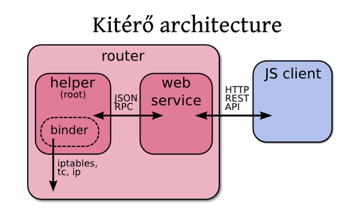

Development
===========

Architecture
------------



The web service is in ``kitero.web`` package while the helper is in
``kitero.helper``. The static files served by the web service include
the JS application and are in ``kitero/web/static``.

``kitero.web`` package is pretty minimal. It contains
``kitero.web.rpc`` module that allows to use helper RPC service.

``kitero.helper``
-----------------

The helper handles all the hard work. It will keep track of each
interface and the associated QoS settings. It will take requests to
bind clients to interfaces and keep track of them. It will also
configure the router to make the binding effective.

Router
``````

The :mod:`kitero.helper.router` module is the model of Kitérő. It
contains inside a single object (the router) the list of interfaces
and each interface contains the list of associated QoS settings.

.. module:: kitero.helper.router
.. autoclass:: Router
   :members:
.. autoclass:: Interface
   :members:
.. autoclass:: QoS
   :members:


Binder
``````

Each time a client is bound or unbound from an interface, the
``notify`` method is called with event equal to ``bind`` or
``unbind``. The important thing to notice about binders is that all
the work should be done in ``notify``, including setting up the router
the first time.

There is currently only one binder:
``kitero.helper.binder.LinuxBinder``. Therefore, there is no mechanism
to select a binder but this can be added in ``kitero.helper.service``
module.

.. module:: kitero.helper.binder
.. autoclass:: LinuxBinder
   :members:

Commands
````````

``kitero.helper.commands`` module provides a class to run several
commands in a row, allowing global substitutions for all the commands
of the same set. An example of use is::

    Commands.run("echo %(arg1)s %(arg2)s", "echo %(arg1)s %(arg3)s",
                 arg1="hello", arg2="kitty", arg3="dude")

.. module:: kitero.helper.commands
.. autoclass:: Commands
   :members:
.. autoclass:: CommandError
   :members:

RPC
```

.. module:: kitero.helper.rpc

The helper communicate with the web service using a very simple JSON
RPC protocol. The general protocol is described in the
:func:`RPCRequestHandler.handle` method.

.. autoclass:: RPCRequestHandler
   :members:

.. module:: kitero.helper.service

The actual protocol is defined in :class:`RouterRPCService` class.

.. autoclass:: RouterRPCService
   :members:

REST API
--------

The API used by the Javascript client can also be used by other
clients. It is a pretty simple API.

========================= =============== =========================================
URL                       Method          Description
========================= =============== =========================================
``/api/1.0/current``      **GET**         Get the current settings for the client.
``/api/1.0/interfaces``   **GET**         Get the list of interfaces and associated
                                          QoS settings.
``/api/1.0/bind/<X>/<Y>`` **POST**,       Bind the client to the interface ``<X>``
                          **PUT**         and QoS ``<Y>``.
``/api/1.0/unbind``       **POST**,       Unbind the client.
                          **PUT**
========================= =============== =========================================

Each call should return HTTP code 200 on success and JSON formatted
data. On errors, a 404 error or a 500 error may be returned. In this
case, the result may or may not be encoded in JSON (actually it is not
encoded in JSON).

In case of success, the returned JSON snippet fits the following format::

  {
    "status": 0, 
    "time": "2011-07-24T00:08:05+0200",
    "value": ...
  }

``status`` is always equal to 0 in case of success. Another value
means a failure. ``time`` contains the server current time. ``value``
contains the actual answer which is specific to each request.

Currently, in case of failure, no JSON data is returned. However, it
is expected that JSON data can be returned. In this case, the format
is the following::

  {
    "status": 45,
    "time": "2011-07-24T00:08:05+0200",
  }

``status`` is always different of 0. The message can contain
additional properties.

.. module:: kitero.web.api
.. autofunction:: current
.. autofunction:: interfaces
.. autofunction:: bind
.. autofunction:: unbind

Tests
-----

The server part is enterily covered with unit tests. You can run the
following commands to run the test suite::

    $ pip install -r dev-requirements.txt
    $ coverage  run --source . \
    >      $VIRTUAL_ENV/bin/unit2 discover -b -f && \
    >  coverage html

The coverage information is stored in ``covhtml/`` directory.

In ``docs/lab``, there is some lab (using `UML
<http://user-mode-linux.sourceforge.net>`_) that can help testing
Kitérő. To setup the lab, just run ``./setup``. You get one router,
``R1`` and three web servers (``W1``, ``W2``, ``W3``). Have a look at
the content of ``setup`` to understand how this works.

Once the lab is up and running, you need to launch Kitérő
yourself. ``docs/sample.yaml`` should work fine with the lab if you
remove ``eth4``.

Documentation
-------------

The documentation can be built using the following command::

   $ python setup.py build_sphinx

Packaging
---------

To get a complete installable source distribution of Kitérő, use the
following command::

   $ python setup.py sdist
