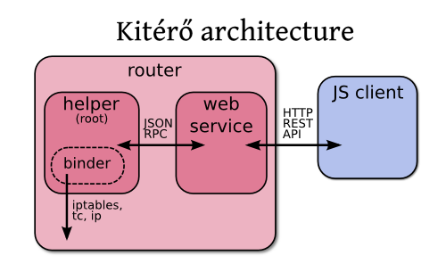

Introduction
============

Main goal
---------

Kitérő should be installed on a router featuring several output
interfaces to access Internet. The user will connect to Kitérő web
interface to choose her output interface (e.g broadband, ADSL, modem)
and an associated QoS (e.g 100 MBps, 50 MBps, 10 MBps with additional
latency). Kitérő will configure the router to let the packets from the
user flow through the choosen interface and apply the appropriate QoS.

*Kitérő* means "railroad switch" in Hungarian.

Architecture
------------

Kitérő has three components:

* a web application written in Javascript and running in the user's browser,
* a web service the application will query to get available options
  and return the interface and the QoS wanted by the user,
* an helper running as root and executing the appropriate commands to
  configure the router.



Web application
```````````````

The web application runs inside user's browser. It is a single-page
HTML/Javascript application. It makes use of modern Javascript
frameworks including `jQuery <http://jquery.com/>`_, `jQuery UI
<http://jqueryui.com/>`_, `Backbone.js
<http://documentcloud.github.com/backbone/>`_, `Underscore.js
<http://documentcloud.github.com/underscore/>`_ and `Modernizr
<http://www.modernizr.com/>`_. Javascript is required to access this
application as no fallback is available.

The application interacts with the web service (which provides a
minimal REST API) by exposing information retrieved from it (user IP,
current interface and QoS, available interfaces and QoS) and pushing
user's requests (wanted interface and QoS). It should work in any
modern browser (which does not include Internet Explorer 6).

Web service
```````````

The web service provides a REST API to allow the web application to
query available interfaces and QoS and apply changes wanted by the
user. It is just a thin HTTP wrapper above the helper which does the
hard work. It also serves static content (but this can be delegated to
a traditional web server).

This component is written with Python and uses `Flask
<http://flask.pocoo.org/>`_, a simple and lightweight microframework.

Helper
``````

Since modifying the router configuration requires root privilege, this
part is done by a separate daemon. This daemon interacts with the web
service using a simple custom JSON RPC protocol. It keeps track of the
available interfaces and QoS. It also records and manages the bindings
between an IP and an interface/QoS set.

The configuration of the router is delegated to a subcomponent (the
binder) which will issue ``iptables``, ``ip`` and ``tc`` commands to apply
the requested bindings.
