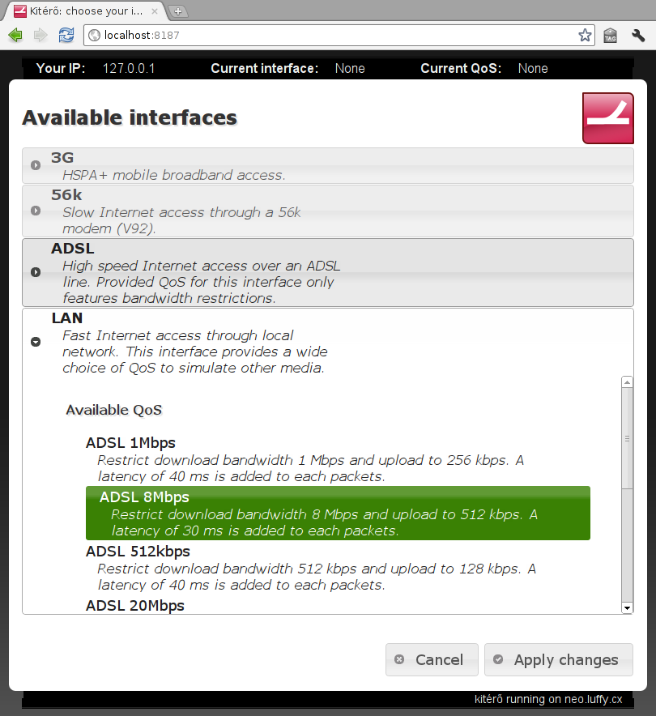

Using Kitérő
============

Kitérő is pretty easy to use. Point your browser to the IP address of
the router. You should get something like this:



General use
-----------

At the top of the screen, you will find your IP address, the currently
selected interface and the currently selected QoS. If you did not
choose any interface, both values are `None`.

Below, you see a list of available interfaces. In our screenshot,
there are 4 available interfaces:

* *3G* for mobile broadband access,
* *56k* for POT line with a 56k modem,
* *ADSL* for access through and ADSL access,
* *LAN* for high speed access through local network.

You can click on any of those interfaces to see available QoS for each
of them. In the example above, we clicked on the "*LAN*" interface and
selected "*ADSL 8Mbps*" as QoS.

Selecting a QoS is mandatory. Kitérő requires you to select both an
interface and a QoS. It is up to the administrator to add a "No QoS
applied" option.

Once you select an interface and QoS different of the current one
(which is displayed in the bar at the top of the screen), the changes
are applied right away. You will see a change in the bar at the top of
the screen when your selection is effective.

It is important to keep the interface open as long as you need the
connection. If the interface is closed, you will be disconnected.

Troubleshooting
---------------

Application does not load
`````````````````````````

If you get a connection refused or similar message, this means that
you did not point your browser to the correction location. Check with
the administrator the URL that you should use.

If you are stuck at the loading screen, ensure that Javascript is
enabled in your browser and no extension (like *NoScript*) disables
Javascript. Have a look at the Javascript console in your browser to
see if there is any error that may prevent the execution of the
application.

Kitérő web service unavailable
``````````````````````````````

When a problem occurs, the application will display a dialog stating
that the service is currently unavailable. This may be a temporary
outage. Try to click on the "*Reload*" button.

If the problem persists, write down your IP address (displayed in the
bar at the top) and the exact time of the incident. With those
information, the administrator will look in the logs of the
application to see exactly what happened.
